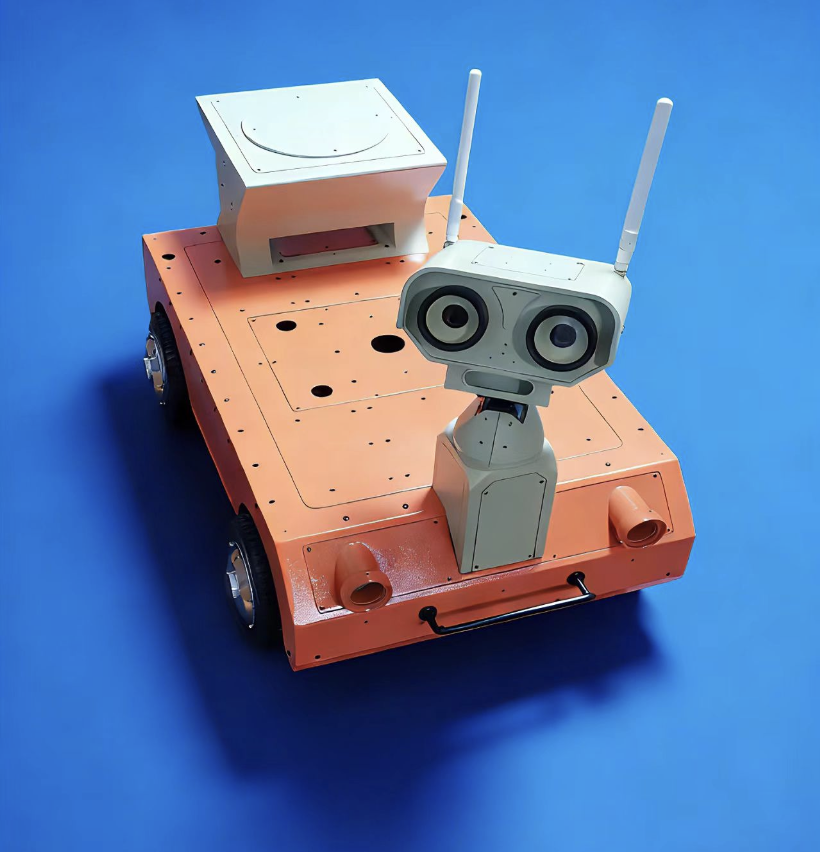
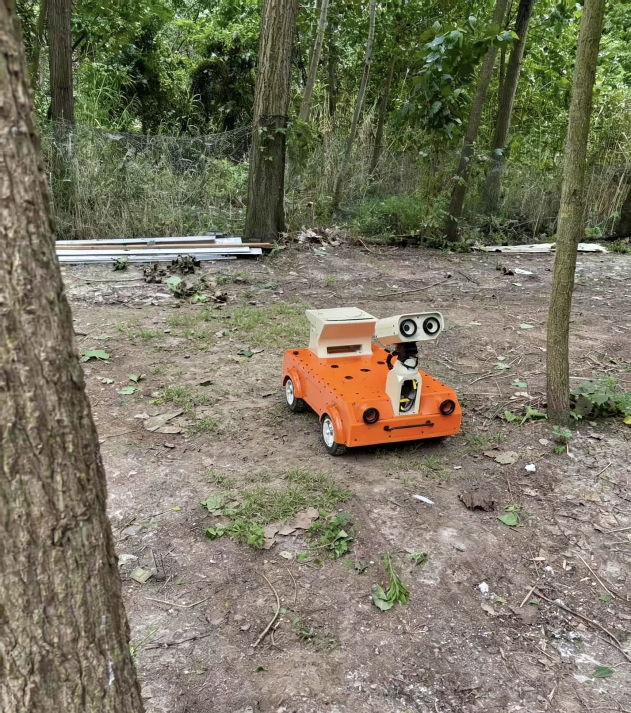

# GeniRover: Autonomous Navigation & Obstacle-Avoidance Differential-Drive Mobile Robot

<div align="center">
  
  
  <p>GeniRover</p>
</div>

A four-wheel differential-drive mobile robot supporting both indoor SLAM/AMCL navigation and outdoor RTK-GPS navigation. Perception uses a 2D LiDAR for mapping/localization, an RGB-D camera for 3D obstacle avoidance via nvblox, an IMU for attitude estimation, and a dual-antenna RTK GNSS for outdoor global positioning. Wheel odometry is fused with IMU via a dual-EKF architecture (local odom→base_link + global map→odom outdoors). Motion is driven by CAN-controlled hub motors via ros2_control. Developed on a laptop and deployed on an NVIDIA Jetson AGX Orin.

## Hardware
| Component | Details |
|---|---|
| Robot Platform | GeniRover four-wheel differential-drive robot |
| Hub Motors | CAN-controlled in-wheel hub motors, gear ratio 5.2:1 |
| Motor Controller | USB-CAN II (dual-channel: front & rear axles) |
| 2D LiDAR | Wheeltec LiDAR |
| RGB-D Camera | Orbbec Gemini 336L (color + aligned depth) |
| IMU | Yahboom 9-axis IMU |
| RTK GNSS | Unicore UM982 dual-antenna receiver, NTRIP RTCM correction |
| Embedded Host | NVIDIA Jetson AGX Orin (Ubuntu 22.04, ROS2 Humble) |

## System Pipeline
```
2D LiDAR (/scan)        IMU (/imu/data_raw)     RGB-D Camera
     │                        │                  (color+depth)
     ▼                        ▼                        ▼
SLAM / AMCL            Madgwick Filter              nvblox
(map→odom, indoor)     (orientation)           (3D voxel map →
     │                        │                  ESDF 2D slice)
     │                        ▼                        │
     │                   /imu/data                     │
     │                        │                        │
RTK GNSS ──> navsat ──> Global EKF                     │
(outdoor)    transform   (map→odom,                    │
             node        outdoor only)                 │
     │              │                                  │
     └──────┬───────┘                                  │
            ▼                                          │
        Local EKF                                      │
   (wheel odom + IMU yaw                               │
    → odom→base_link)                                  │
            │                                          │
            └─────────────┬────────────────────────────┘
                          ▼
                      Nav2 Stack
               (Navfn + MPPI controller
                + costmap obstacle/nvblox/inflation)
                          │
                          ▼
                     /cmd_vel (Twist)
                          │
                          ▼
                ros2_control diff_drive
                    → CAN hub motors
```

## Repository Structure
```
geni_rover/
├── car_description/        # URDF robot model & RViz display
├── car_motor_control/      # Legacy motor driver node (USB-CAN II)
├── gps_ntrip_py/           # RTK GNSS driver: UM982 serial + NTRIP RTCM bridge
├── imu_ros2_device/        # Yahboom IMU driver + Madgwick filter
├── lslidar_driver/         # Wheeltec LiDAR driver
├── lslidar_msgs/           # Custom LiDAR ROS2 messages
├── navigate_frame/         # EKF/Nav2/SLAM configs, launch files, RTK outdoor layer, nvblox, maps
└── wheeltec_udev.sh        # udev rules for stable USB device symlinks
```

## Environment
- Ubuntu 22.04 LTS
- ROS2 Humble (running in Docker on Jetson AGX Orin)
- Python 3.10
- NVIDIA Container Toolkit (GPU passthrough, required by nvblox)
- Isaac ROS nvblox (GPU-accelerated 3D voxel mapping)

## Notes
- **Motor control**: CAN hub motors driven via ros2_control (diff_drive_controller + can_diff_drive_hw). car_motor_control/ is the legacy standalone node.
- **Dual-EKF fusion**: Local EKF fuses wheel odom + IMU yaw → odom→base_link. Outdoor mode adds a global EKF fusing RTK position + dual-antenna heading → map→odom.
- **Depth camera & nvblox**: Orbbec Gemini 336L feeds color + aligned depth to nvblox (dynamic 3D mapping → ESDF slice), detecting low/hanging obstacles invisible to 2D LiDAR. Auto-starts after localization converges.
- **RTK outdoor mode**: outdoor:=true switches to RTK-GPS localization (no pre-built map, rolling costmap). Dual-antenna true-north heading + NTRIP cm-level fix; only RTK-fixed solutions are forwarded to the EKF.
- **Docker on Jetson**: Full ROS2 stack in Docker. USB devices via --device, NVIDIA Container Toolkit for GPU.
- **Workflow**: ros2 launch navigate_frame bringup.launch.py — slam:=true for mapping, slam:=false map:=... for indoor AMCL, outdoor:=true for RTK outdoor.

## Build
```bash
mkdir -p ~/geni_rover_ws/src && cd ~/geni_rover_ws/src
git clone https://github.com/nanj-robotics/geni_rover.git
cd ~/geni_rover_ws
rosdep install --from-paths src --ignore-src -r -y
colcon build --symlink-install
source install/setup.bash
```

## References
- Nav2: https://github.com/ros-navigation/navigation2
- slam_toolbox: https://github.com/SteveMacenski/slam_toolbox
- robot_localization: https://github.com/cra-ros-pkg/robot_localization
- OrbbecSDK_ROS2: https://github.com/orbbec/OrbbecSDK_ROS2
